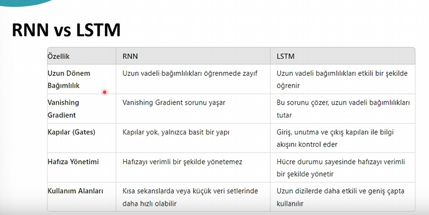

RNN 
    RNN ile NLP alanında yapılan uygulamalar
        Dil Modellemen
        Makine Çevirisi
        Duygu Analizi
        Konuşma Tanıma
        Metin Üretme
    RNN nelerdegradiant sorunu var cok derin işlemlerde önceki veriyi kaybediyor çünkü zaman bağlı sürekli türev alınınca 0 a yaklaşıyor buda geçmişi unutmasına sebep oluyor ile
    RNN araştır
    TEKRARLAYAN SİNİR AĞIDIR
    

LSTM
    kullanım alanları
        doğal diş işlemlerde  ( NLP )
        konuşmayı yazıya dönüştürme   (classification)
        zaman dizisi verilerinden gelecekteki verileri tahmin etme       (prediction)
        müzik ve maetin üretimi işlemlerinde kullanılabilir
        videodaki kareler arasındaki zamansal bağımlılıklarıöğrenerek özet fealn cıkartabiliryoralr
        
        LSTM VE RNN ARASINDAKİ BENZERLİKLER FARKLILIKLAR
        